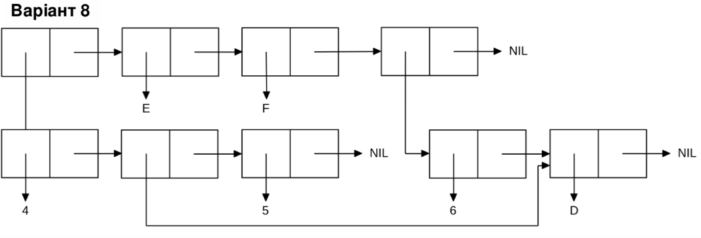

<p align="center"><b>МОНУ НТУУ КПІ ім. Ігоря Сікорського ФПМ СПіСКС</b></p>
<p align="center">
<b>Звіт з лабораторної роботи 1</b><br/>
"Обробка списків з використанням базових функцій"<br/>
дисципліни "Вступ до функціонального програмування"
</p>

<p align="right"> 
<b>Студент</b>: 
<em> Дмитрієвцев Михаїл Валерійович КВ-12</em></p>

<p align="right"><b>Рік</b>: <em>2024</em></p>

## Загальне завдання

```lisp
;; Пункт 1 (створення списку)
CL-USER> (setq mylist (list 1 'a '(1 2) 'b  (list)))
(1 A (1 2) B NIL)

;; Пункт 2 (отримання голови списку)
CL-USER> (car mylist)
1
;; Пункт 3 (отримання хвоста списку)
CL-USER> (cdr mylist)
(A (1 2) B NIL)
    ;або
CL-USER> (nthcdr 1 mylist)
(A (1 2) B NIL)

;; Пункт 4 (отримання третього елемента списку)
CL-USER> (third mylist)
(1 2)
    ;або
CL-USER> (nth 2 mylist)
(1 2)

;; Пункт 5 (отримання останнього елемента списку)
CL-USER> (car (last mylist))
NIL

;; Пункт 6 (Використання предикатів ATOM та LISTP)
;;ATOM
CL-USER> (atom `KPI)
T
CL-USER> (atom 1)
T
CL-USER> (atom `(1))
NIL
CL-USER> (atom nil)
T
;;LISTP
CL-USER> (listp mylist)
T
CL-USER> (listp '(1 2))
T
CL-USER> (listp 'KPI)
NIL
CL-USER> (listp nil)
T
;; Пункт 7 (Використання інших предикатів)
;;NUMBERP
CL-USER> (numberp mylist)
NIL
CL-USER> (numberp 1)
T

;;EQ
CL-USER> (eq 1 1.0)
NIL
CL-USER> (eq 1 1)
T
CL-USER> (eq '(2 3) `(2 3))
NIL

;;EQUALP
CL-USER> (equalp '(2 3) `(2 3))
T
CL-USER> (equalp 1 1.0)
T

;; Пункт 8 (Об'єднання списку із підсписком)

CL-USER> (setq mylist (list 1 'a '(1 2) 'b  (list)))
(1 A (1 2) B NIL)
CL-USER> (append (third mylist) mylist)
(1 2 1 A (1 2) B NIL)
```

## Варіант 8
<p align="center"></p>

### Лістинг команди конструювання списку та результат її виконанння
```lisp
(let ((x (list 6 `d))) ;перша форма
    ;;друга форма, що містить підсписки
     (list (list 4 (cdr x) 5) 'E 'F x)
) 
((4 (D) 5) E F (6 D)) ;результат виконання
```